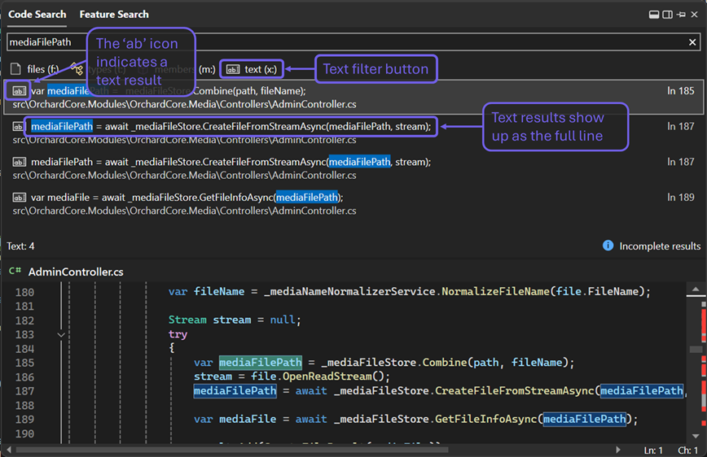

Ve vyhledávání pomocí rozšíření Code Search typu Vše v jednom (`Ctrl+T` nebo `Ctrl+,`) můžete vyhledat libovolné slovo nebo řetězec znaků v rámci celého řešení a doplnit tak výsledky vyhledávání souborů a symbolů z vaší kódové báze. Můžete teď vyhledávat názvy místních proměnných, slova v komentářích, názvy parametrů nebo jakýkoli jiný řetězec znaků v celé kódové bázi.

 

V textovém zobrazení si můžete vyfiltrovat jenom textové výsledky jedním z následujících způsobů:

- Klikněte na tlačítko Text (x:) pod vyhledávacím panelem,
- Před vyhledávacím dotazem použijte předponu „x:“,
- Použijte klávesovou zkratku `Shift+Alt+F` nebo
- Přejděte na možnost nabídky Upravit > Přejít na > Přejít na text.

V textovém prostředí můžete také pomocí tlačítka úplně vpravo na panelu hledání přepínat mezi možnostmi Rozlišovat velikost písmen, Celé slovo, Použít regulární výrazy.

Další informace o podpoře fulltextového vyhledávání pomocí rozšíření Code Search najdete [tady](https://devblogs.microsoft.com/visualstudio/17-9-preview-3-brings-exciting-changes-to-code-search). 

Pokud tlačítko textového filtru textu v okně Code Search není dostupné, můžete ho ručně povolit zapnutím funkce Preview: Nástroje > Možnosti > Prostředí > Funkce Preview > Vyhledávání ve formátu prostého textu v Hledání Vše v jednom (vyžaduje restartování). 

Toto prostředí budeme dále zdokonalovat. Proto nám prosím dejte vědět, co si o novém vyhledávacím prostředí myslíte, na webu [Developer Community](https://developercommunity.visualstudio.com/t/Improve-Visual-Studio-All-In-One-Search/10333885?space=8&entry=suggestion).
