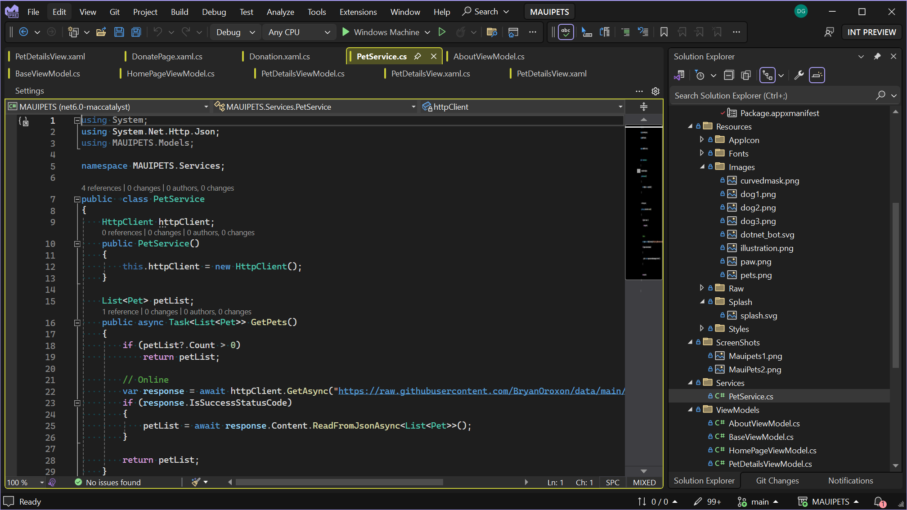

Aktualizace uživatelského rozhraní sady Visual Studio, které jsme avizovali již v květnu, je konečně k dispozici k vyzkoušení. Tato verze Preview přináší nové uživatelské rozhraní pro Visual Studio postavené na třech hlavních pilířích: jednotnost, přístupnost a produktivita.
- Nové uživatelské rozhraní je v souladu s designovým jazykem Microsoft Fluent, který se používá v mnoha dalších produktech Microsoftu, včetně Microsoftu 365. Visual Studio poskytne prostředí, které je ve větším souladu s dalšími produkty Microsoftu.
- Uživatelské rozhraní sady Visual Studio zvětšuje ovládací prvky, aby pomohlo lidem s pohybovým postižením, a cíleněji používá barvy, aby se zlepšila přehlednost při zachování hustoty informací.
- Vyšší konzistence snižuje kognitivní zatížení a zvyšuje produktivitu.
 

 
Pokud chcete aktualizaci uživatelského rozhraní povolit, zapněte v části Funkce Preview možnost Experimentální styly ovládacích prvků a restartujte Visual Studio.
 
Modrý motiv není momentálně k dispozici. Pokud povolíte aktualizaci uživatelského rozhraní a vyberete modrý motiv, sada Visual Studio po restartování použije motiv Cool Breeze.
 
Zajímá nás vaše zpětná vazba k novému prostředí. [Dejte nám vědět, co na něj říkáte.](https://aka.ms/uirefresh179devcomm)
