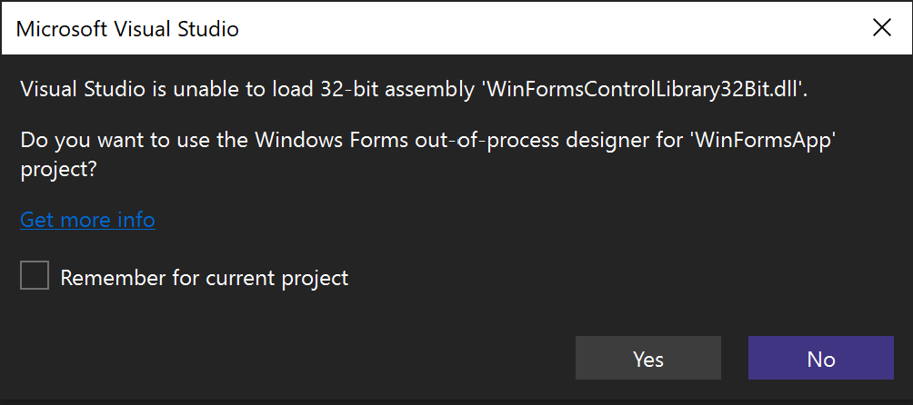

Pro projekty rozhraní .NET Framework, které odkazují na 32bitová sestavení, teď můžete použít mimoprocesového návrháře Windows Forms (WinForms).

Návrhář WinForms automaticky rozpozná chyby načtení 32bitového sestavení a poskytne možnost použít pro daný projekt mimoprocesového návrháře.

Mimoprocesový návrhář WinForms vytvoří podřízený proces, který dokáže načíst 32bitová sestavení. Visual Studio bude s tímto procesem komunikovat, aby zobrazil návrháře.
Další informace o této funkci najdete [tady](https://aka.ms/winforms/designer/WhatsNewDesignerSelection).

Ve výchozím nastavení je tato funkce zapnutá. Můžete ho povolit nebo zakázat tak, že přejdete na **Nástroje** > **Možnosti** > **Prostředí** > **Funkce Preview** prostřednictvím možnosti pro zjišťování selhání načtení 32bitového sestavení pro projekty Windows Forms .NET Framework.

Pokud máte zpětnou vazbu k této funkci, o kterou se s námi můžete podělit, přispějte prosím do diskuze na stránce [Developer Community](https://developercommunity.visualstudio.com/t/WinForms-NET-Framework-Projects-cant-d/1601210).

