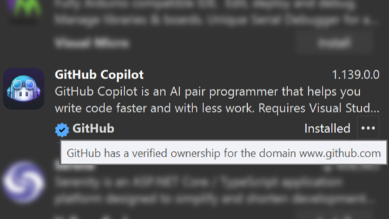

Mit unserem modernisierten Erweiterungsmanager (derzeit als Previewfunktion verfügbar) können Sie ganz einfach ermitteln, ob Herausgeber den Besitz der Domänen verifiziert haben, die ihren Erweiterungen zugeordnet sind. Wenn Sie im Visual Studio Marketplace nach Erweiterungen suchen, gibt ein Häkchensymbol neben der Domäne im Erweiterungsdetailbereich an, dass der Herausgeber der verifizierte Besitzer dieser Domäne ist. 

Verifizierte Domänen werden im neuen Erweiterungsmanager unterstützt. Sie können das Feature ausprobieren, indem Sie die Previewfunktion „Benutzeroberflächenaktualisierung für Erweiterungsmanager“ über **Tools** > **Optionen** > **Umgebung** > **Previewfunktion** aktivieren. Der neue Erweiterungsmanager bietet umfassende, detaillierte Erweiterungsbeschreibungen, die Ihnen helfen, Erweiterungen zu finden, die Ihre Produktivität steigern und Ihnen helfen, Visual Studio zu personalisieren!

Wenn Sie Feedback oder Vorschläge zur Verbesserung des Erweiterungs-Managers haben, teilen Sie uns diese in der [Entwicklercommunity](https://developercommunity.visualstudio.com/t/Modern-Extension-Manager-for-Visual-Stud/10401804) mit.
