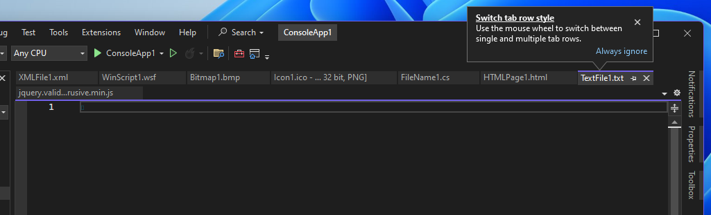

For those of you that work with many documents at the same time, this feature is for you! You can now quickly switch between single and multiple tab rows in Visual Studio's document well by scrolling the mouse wheel.

A tip will appear the first time you open more tabs than can fit in a single row of the document well.

Scrolling down on the mouse wheel while hovering over the tabs in the document well will show multiple tab rows; scrolling up will collapse down to a single tab row. 

If you have any feedback or suggestions on this experience, please share them with us on [Developer Community](https://developercommunity.visualstudio.com/t/scrollable-open-file-tabs-with-mouse-wheel/353560).
