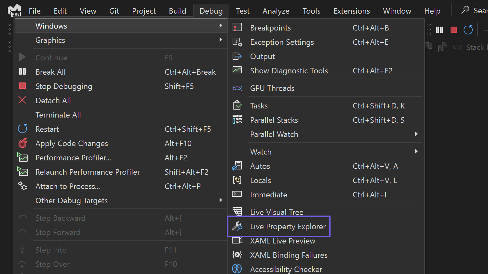

Dedique menos tiempo a depurar y más a crear aplicaciones excelentes.

El Explorador de propiedades dinámico, una herramienta potente que permite un desarrollo más eficaz, ahora se admite con .NET MAUI. Permite ver y ajustar fácilmente las propiedades de los controles de la aplicación en runtime, lo que resulta especialmente útil cuando busca depurar problemas, optimizar el rendimiento o investigar dónde se define una propiedad en XAML. 

Para acceder al Explorador de propiedades dinámico, inicie y depure la aplicación. Después, vaya a **Depurar** > **Windows** > **Explorador de propiedades dinámico**.

Una vez que haya abierto el Explorador de propiedades dinámico, puede usarlo para explorar y editar propiedades en directo en su aplicación .NET MAUI. Para obtener más información, vea el vídeo de demostración siguiente o visita [Inspección de propiedades XAML durante la depuración](https://learn.microsoft.com/visualstudio/xaml-tools/inspect-xaml-properties-while-debugging).

Si tiene algún comentario o sugerencia sobre esta experiencia, compártalos con nosotros mediante [Developer Community](https://developercommunity.visualstudio.com/t/Live-Property-Explorer-doesnt-show-prop/1703289).

