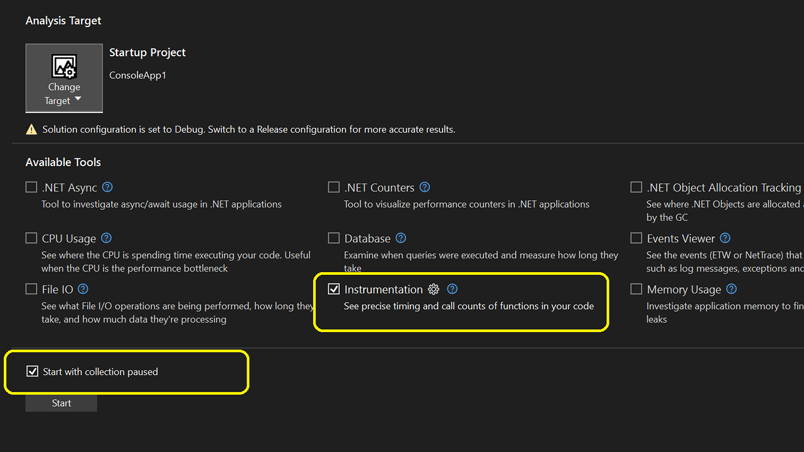

La herramienta Instrumentación ahora admite la opción "Iniciar-Pausar" en la generación de perfiles de aplicaciones. Esta característica permite pausar temporalmente la recopilación de datos, lo que permite iniciar la aplicación en el control del generador de perfiles sin recopilar datos inmediatamente.
Cuando esté a punto, simplemente presione el botón grabar para comenzar la recopilación de datos. Esta función es especialmente útil en escenarios como juegos, donde los usuarios quieren profundizar en el juego y configurar la reproducción de problemas antes de que se inicie la recopilación de datos. 

La característica funciona sin problemas con proyectos nativos y administrados.

