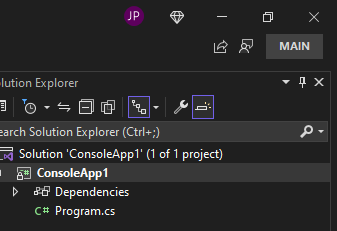

Votre abonnement offre de nombreux avantages supplémentaires en dehors de l’IDE. Pour découvrir et activer vos avantages, vous pouvez maintenant utiliser la nouvelle icône de diamant dans la barre d’outils de Visual Studio, en haut à droite. Cette fonctionnalité est disponible seulement pour les abonnés Visual Studio Enterprise et Professional connectés.

Quand vous cliquez sur l’icône, vous voyez les principaux avantages que les développeurs apprécient le plus. Vous pouvez aussi accéder facilement à [votre portail d’abonné](https://my.visualstudio.com) pour voir des avantages supplémentaires, comme des ressources de formation, du support et des téléchargements de produits.

Cliquez sur le diamant pour découvrir ce qui est disponible pour vous aider à optimiser votre expérience de développeur.
