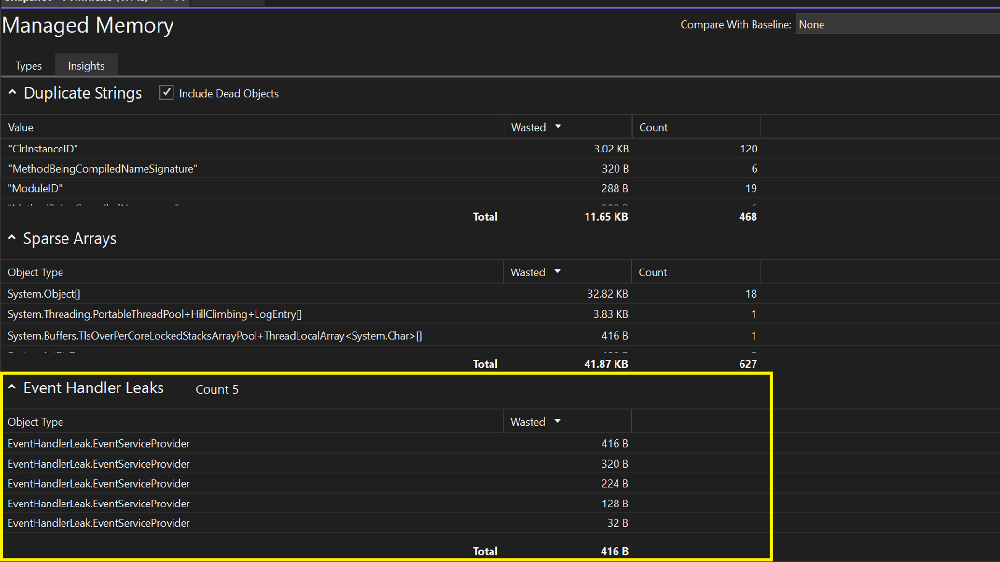
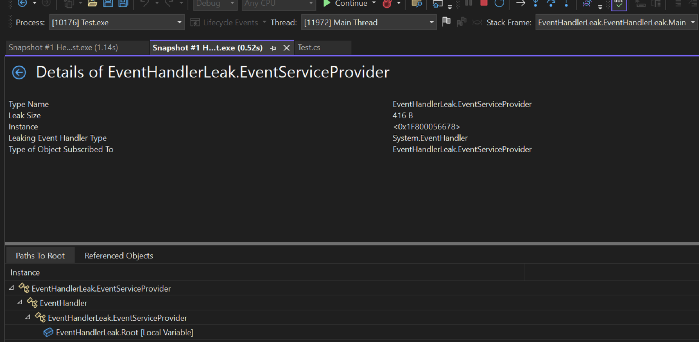

L’onglet « Gérer les insights sur la mémoire » fournit désormais de nouvelles informations utiles. Il peut détecter les « fuites de gestionnaire d’événements » qui peuvent potentiellement se produire lorsqu’un objet s’abonne à l’événement d’un autre objet. Si l’éditeur de l’événement survit à l’abonné, ce dernier reste actif, même s’il n’y a pas d’autres références à celui-ci. Cela peut entraîner des fuites de mémoire, où la mémoire inutilisée n’est pas correctement libérée, ce qui entraîne l’utilisation par l’application de plus et plus de mémoire au fil du temps.

Grâce au nouvel aperçu automatique des « fuites du gestionnaire d’évènements », l’identification des problèmes liés à la mémoire du gestionnaire d’évènements et à la mémoire gaspillée est désormais beaucoup plus facile.

Veuillez partager vos impressions globales, comment nous pouvons l’améliorer et tout commentaire supplémentaire que vous pouvez avoir sur cette expérience via la [Communauté](https://developercommunity.visualstudio.com/VisualStudio) des développeurs.
