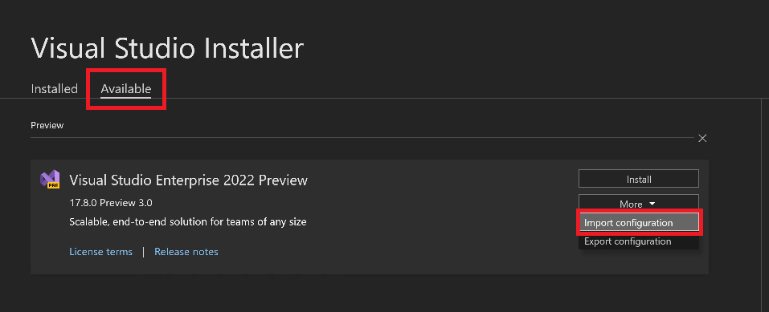

À compter de la version 17.9 de Visual Studio 2022, vous pouvez inclure diverses extensions ([Visual Studio Marketplace](https://marketplace.visualstudio.com/), locales, réseau, URL personnalisée, [galerie privée](https://learn.microsoft.com/visualstudio/extensibility/private-galleries)) dans votre [fichier vsconfig](https://learn.microsoft.com/visualstudio/install/import-export-installation-configurations#extensions). Le programme d’installation de Visual Studio les charge et les met à disposition des utilisateurs. Cette fonctionnalité répond à l’une des principales [demandes de fonctionnalités de notre Developer Community : « Un fichier .vsconfig doit automatiquement invité à installer des extensions »](https://developercommunity.visualstudio.com/t/A-vsconfig-file-should-automatically-pr/518364).

Toutes les extensions installées par le programme d’installation de VS sont installées « à l’échelle de l’ordinateur », ce qui signifie qu’elles sont accessibles à tous les utilisateurs. Étant donné que ces extensions sont installées à l’échelle de l’ordinateur, l’utilisateur qui les installent doit avoir des privilèges d’administrateur directement, ou doit avoir reçu le contrôle via la stratégie [AllowStandardUserControl](https://aka.ms/vs/setup/policies). Notez que la plupart des extensions installées par le Gestionnaire d’extensions existant peuvent être installées par utilisateur, et non à l’échelle de l’ordinateur. Ainsi, l’utilisateur qui installe ces extensions n’a pas besoin d’autorisations d’administrateur.

Il existe trois façons principales d’importer un fichier *.vsconfig dans Visual Studio :

### 1. Utiliser l’interface utilisateur du programme d’installation VS pour ajouter des extensions à une installation

Vous pouvez lancer le programme d’installation de VS et importer un [fichier config d’installation (*.vsconfig)](https://learn.microsoft.com/visualstudio/install/import-export-installation-configurations) dans une installation existante répertoriée sous l’onglet Installé ou l’utiliser pour préconfigurer une nouvelle installation via l’onglet Disponible. Dans les deux cas, vous devez choisir la configuration Plus/Importer, hors de la carte produit du programme d’installation, pour importer les extensions dans l’installation souhaitée.   

### 2. Ajouter par programmation des extensions à une installation de Visual Studio à l’aide du paramètre --config

Pour effectuer une **nouvelle installation** de Visual Studio et l’initialiser avec un fichier config qui contient des extensions, exécutez la commande suivante à l’aide du programme de démarrage système :

`vs_enterprise.exe --config "C:\my.vsconfig" --installPath "C:\VS"`

Pour **modifier** une installation existante et ajouter des extensions en passant un fichier *.vsconfig contenant des extensions, vous pouvez utiliser la commande modify qui utilise le programme d’installation de VS présent sur l’ordinateur :

`"C:\Program Files (x86)\Microsoft Visual Studio\Installer\setup.exe" modify --installPath "C:\VS" --config "C:\my.vsconfig"`

Cliquez ici pour obtenir [plus d’informations sur les paramètres de ligne de commande du programme d’installation VS](https://learn.microsoft.com/visualstudio/install/use-command-line-parameters-to-install-visual-studio).

### 3. Ouvrez une solution ou un référentiel qui contient un fichier vsconfig

Lorsqu’un utilisateur ouvre une solution ou un référentiel, Visual Studio analyse un fichier *.vsconfig inclus et détecte automatiquement si des composants spécifiés, et *désormais des extensions Marketplace*, sont présents ou manquants. S’il est manquant, l’utilisateur est invité à les installer. Pour des raisons de performances, les extensions hébergées localement ou sur le réseau ne font pas encore partie du processus de détection d’éléments manquants. Les documents en ligne décrivent plus en détail cette possibilité de [détecter et d’installer automatiquement les composants manquants](https://learn.microsoft.com/visualstudio/install/import-export-installation-configurations#automatically-install-missing-components). 

### Mises en garde

À l’heure actuelle, vous pouvez uniquement inclure des extensions dans un fichier *.vsconfig et les installer dans Visual Studio 2022 et versions ultérieures à l’aide du programme d’installation de VS version 17.9 ou ultérieure. En outre, le programme d’installation de Visual Studio ne prend pas encore en charge l’_exportation_ d’extensions vers un fichier config. Les extensions sont mises à jour par le biais de la [méthode existante de mise à jour d’extensions décrite ici](https://learn.microsoft.com/visualstudio/ide/finding-and-using-visual-studio-extensions?#automatic-extension-updates).  

Certaines extensions internes (comme Copilot ou Liveshare) sont directement incluses dans le programme d’installation de Visual Studio et se comportent comme des composants normaux. 

Essayez cette fonctionnalité et [faites-nous savoir ce que vous en pensez !](https://developercommunity.visualstudio.com)

