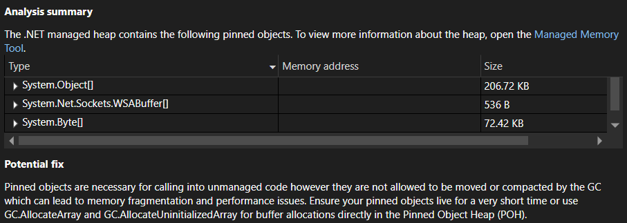

L'analisi dei dump della memoria di Visual Studio è stata migliorata per riepilogare meglio le informazioni critiche per i clienti che esaminano i problemi correlati alla memoria:

- Filtrare gli oggetti finalizzabili e l'elenco di code del finalizzatore al codice del cliente

- Migliorare le informazioni di riepilogo per gli analizzatori POH + LOH da raggruppare per tipo

- Mostrare le dimensioni degli oggetti in unità descrittive

Condividi le tue impressioni generali, come possiamo migliorarla e qualsiasi feedback aggiuntivo che potresti avere su questa esperienza tramite [Developer Community](https://developercommunity.visualstudio.com/VisualStudio).
