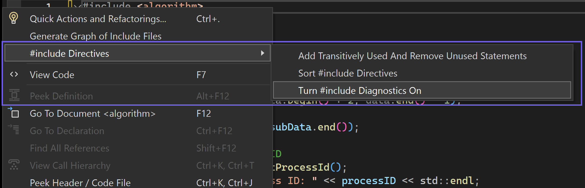

Esse recurso permite que você acompanhe convenientemente a frequência e os locais em que suas diretivas de #include foram utilizadas. 

Ele fornece uma contagem de quantas vezes cada uma de suas \#diretivas de inclusão foi referenciada em sua base de código. Você pode clicar na contagem de referências para acessar uma lista de referências específicas. A partir daí, um clique duplo na referência desejada levará você diretamente ao seu local.

Ao executar o Build Insights, esse recurso apresentará o tempo de compilação associado a cada diretiva #include, juntamente com as respectivas referências.

Por padrão, esse recurso está desativado. Quando precisar analisar suas diretivas #include, você poderá habilitar esta opção acessando o menu de contexto por meio de um clique com o botão direito do mouse no editor de código. Posteriormente, passe o mouse sobre a opção "#include Diretivas" e selecione "Ativar \#Incluir Diagnósticos". 

Por favor, compartilhe suas impressões gerais, como podemos melhorá-lo e qualquer feedback adicional que você possa ter sobre essa experiência por meio da [Comunidade](https://developercommunity.visualstudio.com/VisualStudio) de desenvolvedores.
