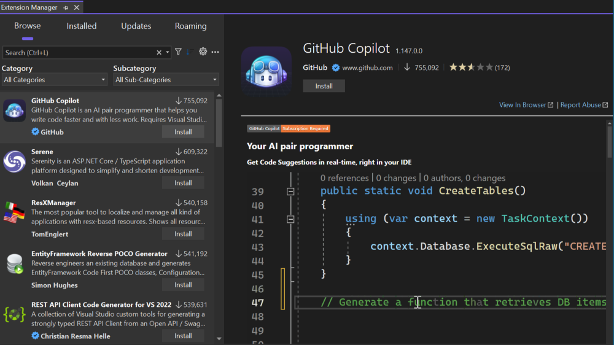
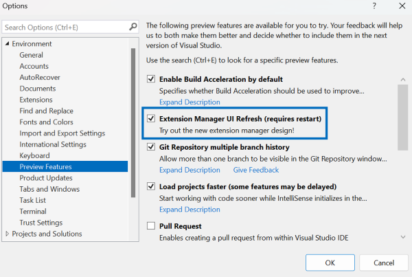

我們已重新設計延伸模組管理員，讓您更輕鬆地從Visual Studio Marketplace 找到絕佳的擴充功能，並改善管理現有的擴充功能。 自 Visual Studio 預覽版的初始版本以來，我們會根據您的意見反應，繼續精簡和改善我們的新設計！ 

重新整理的 UI 會在您選取每個延伸模組時顯示其描述，而不會要求您瀏覽至 Web 上的 Visual Studio Marketplace 以取得詳細資料。 您現在可以深入了解延伸模組，而不需要離開 Visual Studio。

透過 [工具]**** > [選項]**** > [環境]**** > [預覽功能]**** 啟用名為「延伸模組管理員 UI 重新整理」的預覽功能，以試用新的延伸模組管理員。

如果您有關於如何改善延伸模組管理員的任何意見反應或建議，請於[開發人員社群](https://developercommunity.visualstudio.com/t/Modern-Extension-Manager-for-Visual-Stud/10401804)與我們分享。

